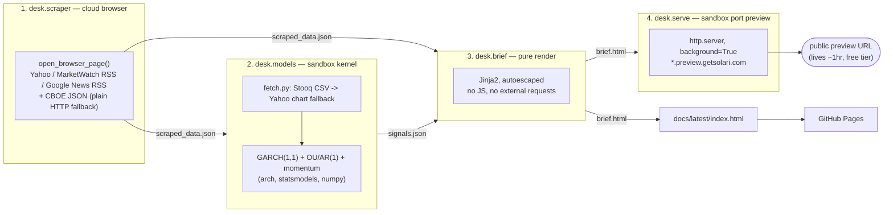

# Overnight options desk

**Status:** shipped (GRE-3464 integration). All five lanes (GRE-3459 spike,
GRE-3460 scraper, GRE-3461 models, GRE-3462 brief, GRE-3463 orchestrator)
are merged and wired end-to-end; `python -m desk.run_overnight` runs the
real chain against the live free-tier API and publishes a brief.

## What it does

Every weekday morning before the market opens, an options desk wants one
page: which names in its watchlist have earnings soon, what the overnight
headlines say, and — for each — a quant read on volatility, mean-reversion,
and momentum. `run_overnight.py` builds exactly that page from a cold
start, unattended: it opens real cloud-browser sessions to scrape earnings
dates / headlines / quotes for a symbol universe (≤5 tickers), fits a
GARCH(1,1) vol forecast + an OU/AR(1) mean-reversion model + 5-day momentum
per symbol inside a throwaway sandbox VM, renders both into one
self-contained `brief.html` (no JS, no external requests — readable from a
bare `file://` URL), and publishes it on a public sandbox preview URL —
then copies the same file to `docs/latest/index.html` for GitHub Pages. For
this repo's demo, that command ran once against `AAPL,NVDA,MSFT,TSLA,AMZN`;
see "Free-tier story" below for what it actually cost and
[the published brief](../../docs/latest/index.html) for what it produced.
No step here is trading advice — every brief carries a
"Research only — not investment advice" disclaimer, and the model outputs
are research labels (`mean-reversion-watch`, `trend-watch`, ...), never buy/
sell signals.

## Architecture



Each stage is invoked by `run_overnight.py` as its own subprocess — a fresh
Solari session per stage, never held across stage boundaries (NG-1) — with
stage checkpointing, retry-then-degrade, and budget accounting in between
(see "Orchestrator" below).

## Contract changes in this integration (GRE-3464)

Wiring the four lanes together surfaced two real contract gaps between
lanes built in parallel against a shared spec — both fixed additively so
nothing that validated against the old shape breaks:

- **`signals.schema.json` gains an optional `label` string** carrying the
  models lane's real research vocabulary (`insufficient-data`,
  `mean-reversion-watch`, `trend-watch`, `event-risk`, `no-strong-signal`)
  as first-class data instead of only inside `notes[]` prose. `verdict`
  stays the closed four-value enum. See "Model rule table" below for the
  full writeup.
- **`scraped_data.schema.json`'s `provenance` gains an optional `replays`
  array** — the subset of `provenance.sessions` that were recorded and are
  downloadable via `solari.sessions.download_replay(session_id)` (Solari's
  replay id *is* the session id — no new id needed). Populated by
  `desk/scraper.py` (mirrors `sessions` when the run's `recording` flag was
  on, empty otherwise) and rendered in `desk/brief.py`'s provenance footer.
- **The orchestrator's assumed `desk.serve` contract was wrong** — see
  "Orchestrator ↔ serve reconciliation" further down for that one; it's a
  behavioral fix, not a schema change.

## The three Solari primitives this example uses

All three are thin wrappers in `desk/solari_client.py`; every helper opens
exactly the resource it needs and closes/kills it before returning (the one
exception, `serve_preview`, is documented below).

- **Cloud browser** (`solari.launch()` → `browser.new_page()`, wrapped as
  `open_browser_page`) — the scraper needs real rendered pages (Yahoo
  Finance, MarketWatch RSS, Google News RSS); several of these don't behave
  the same over a plain HTTP GET (missing JS-rendered content, or outright
  blocked). Every fetch is a fresh, closed session.
- **Sandbox code interpreter** (`SandboxClient.create()` → `run_code()`,
  wrapped as `run_in_sandbox`) — the quant models need `numpy`/`arch`/
  `statsmodels`; installing scientific-Python for every reader of this repo
  just to look at the code would be a bad trade. The sandbox installs them
  fresh, fits the models, and is `kill()`ed — one throwaway VM per run.
- **Sandbox port preview** (`SandboxClient` + `commands.run(...,
  background=True)` + `sandbox.preview_url()`, wrapped as `serve_preview`)
  — publishes the finished `brief.html` on a public
  `*.preview.getsolari.com` URL with no deploy step, so the morning brief
  is curl-able the moment the pipeline finishes.

## Free-tier story

Free tier: 1 concurrent sandbox, 3 concurrent browsers, sequential live
work. Every helper in `desk/solari_client.py` prints a `[spend]` estimate
line (`resource: Ns ~= $X @ rate/hr`) on every call; `run_overnight.py`
sums these into `runs/<date>/budget.json`. Cumulative spend across every
live probe this project has run — prior lanes' AC testing plus this
integration ticket's real end-to-end demo:

- Prior lanes (GRE-3459 spike + GRE-3460 scraper + GRE-3461 models AC live
  testing): **≈$0.02**
- This ticket's real `run_overnight` demo run below
  (`AAPL,NVDA,MSFT,TSLA,AMZN`, `runs/2026-08-31/budget.json`): **$0.0309**
  (scraper $0.0048, models $0.0011, brief $0.0000, serve $0.0250 —
  the serve figure is an *estimated* charge for the requested 900s preview
  hold, not a measured actual; see "Orchestrator ↔ serve reconciliation"
  below for why).
- **Cumulative project spend: ≈$0.0509** — against a $2.00 ticket budget
  and a $0.60 live-work budget for this ticket alone. Not rounded up.

Nothing here needs a paid plan — every primitive above (recording,
port preview, the sandbox `base` template) was confirmed working on the
free tier during the GRE-3459 spike (see "Spike findings").

## Real end-to-end run (GRE-3464 demo)

```
python -m desk.run_overnight --symbols AAPL,NVDA,MSFT,TSLA,AMZN --serve-hold-seconds 900
```

```
=== overnight desk run 2026-08-31 — status: full ===
  scraper  ok       attempts=1 duration=42.00s spend=$0.0048
  models   ok       attempts=1 duration=41.96s spend=$0.0011
  brief    ok       attempts=1 duration=0.10s  spend=$0.0000
  serve    ok       attempts=1 duration=0.97s  spend=$0.0250
  budget total: $0.0309
  preview: https://bf81fd6689b42fa152c3-8000.preview.getsolari.com
  (?pt_token=... stripped — see NG-3; curled 200 while the preview was alive)
  brief: docs/latest/index.html
  run dir: runs/2026-08-31
```

- **Every stage ran real** — no stubs, no `--dry-run`. `scraper` hit the
  live free-tier API for 5 symbols (15 recorded browser sessions; Nasdaq's
  earnings page failed with `net::ERR_HTTP2_PROTOCOL_ERROR` on every symbol
  exactly as documented in "Limitations" and fell through to the Yahoo
  earnings calendar fallback every time — see `runs/2026-08-31/scraped_data.json`'s
  `warnings[]`).
  `models` hit the sandbox-clock-skew TLS workaround live too (every
  symbol's `notes[]` carries a `tls-clock-skew-workaround` entry) and still
  produced valid GARCH/OU/momentum fits for all 5 symbols via the Yahoo
  chart price fallback (Stooq returned 0 usable closes this run).
- **Verdicts** (real market data, not fixture): 4 of 5 symbols came back
  `avoid` / `mean-reversion-watch` (stretched OU z-scores, elevated
  annualized vol forecasts — MSFT z=+6.48, NVDA z=+4.78, AMZN z=+3.71, TSLA
  z=−3.45), AAPL came back `neutral` / `no-strong-signal`. See
  `runs/2026-08-31/signals.json` for the full per-symbol output including
  `label`.
- **Artifacts**: `runs/2026-08-31/{scraped_data.json, signals.json,
  brief.html, run.log, budget.json, state.json}` — all present, all
  schema-valid, `state.json.status == "full"`.
- **Published brief**: `docs/latest/index.html` is a byte-for-byte copy of
  `runs/2026-08-31/brief.html` (verified via checksum) — real universe,
  real quotes, real labels, not the fixture data used by the hermetic
  tests.
- **Screenshot**: `docs/latest/brief-screenshot.jpg`, captured from the
  live preview URL while it was up.

## Quickstart

```bash
git clone https://github.com/erichenschel/solari-cookbook.git
cd solari-cookbook

cp examples/overnight-options-desk/.env.example .env
# edit .env: SOLARI_API_KEY=slr_live_... (grab one at console.getsolari.com)

python3 -m venv .venv-desk
.venv-desk/bin/pip install -r examples/overnight-options-desk/requirements.txt

# hermetic — no network, no key needed
.venv-desk/bin/pytest examples/overnight-options-desk/tests -m "not live" -q

# the real overnight run (live API, one sandbox + a few browser sessions)
set -a; source .env; set +a
cd examples/overnight-options-desk
python -m desk.run_overnight --symbols AAPL,NVDA,MSFT,TSLA,AMZN
```

That last command chains scrape → models → render → serve and prints a
summary — per-stage status/timing/spend, the total budget, and the preview
URL — see "Orchestrator" below for what each flag does and "Real
end-to-end run" for what a real run of it produced.

## Limitations (read before you rely on this)

- **Preview lifetime is capped at ~1hr** (free-tier sandbox idle-kill
  window — `desk/serve.py`'s `MAX_HOLD_S`). The preview URL printed by a
  run — and the one linked from this README — goes dead after that; the
  durable artifact is `docs/latest/index.html` / `runs/<date>/brief.html`,
  not the URL.
- **No stealth mode, so Nasdaq's earnings page is blocked.** A vanilla
  cloud browser gets `net::ERR_HTTP2_PROTOCOL_ERROR` from
  `nasdaq.com/market-activity/...` every time (confirmed at build time and
  live) — the scraper always falls through to the Yahoo/StockAnalysis
  fallbacks. A deployment that specifically needs Nasdaq would want
  Solari's stealth + residential-proxy browser mode (see
  [browser-stealth-proxy-ts](../browser-stealth-proxy-ts)) instead.
- **Sandbox VM clock can be stuck in the past** (observed ~4 weeks behind
  real time), which makes legitimately valid HTTPS certs look "not yet
  valid." Worked around in `fetch.py`'s `_urlopen_tolerant` with one
  documented, narrowly-scoped unverified retry — never silent, always
  leaves a `tls-clock-skew-workaround` note. See "Live sandbox findings"
  below for the full writeup.
- **Research only.** Every rendered brief carries a
  "Research only — not investment advice" disclaimer in its footer; the
  verdict/label vocabulary (`mean-reversion-watch`, `trend-watch`,
  `event-risk`, ...) describes what a human analyst might flag for further
  reading, not an order or execution instruction.

## Layout

```
desk/
  solari_client.py   # open_browser_page / run_in_sandbox / serve_preview
  contracts.py         # dataclasses + load/validate for both contracts
  schemas/             # JSON Schema for scraped_data and signals
  scraper.py           # scraper-lane CLI: symbols -> scraped_data.json (GRE-3460)
  models.py            # models-lane CLI: scraped_data.json -> signals.json (GRE-3461)
  model_code/          # uploaded into the sandbox AND imported locally
    prices.py          # pure CSV/JSON parsing -> list[float] closes
    signals.py         # GARCH / OU(AR1) / momentum / verdict rule table
    fetch.py           # network: Stooq primary, Yahoo chart fallback
    driver.py          # sandbox-side glue: fetch + signals -> signals.json body
    runner.py          # subprocess entry point (fresh interpreter, see "Live sandbox findings")
  brief.py             # brief-lane CLI: scraped_data + signals -> brief.html (GRE-3462)
  serve.py             # publishes a file on a sandbox port-preview URL
  run_overnight.py     # orchestrator: scrape -> models -> render -> serve (GRE-3463)
  stubs.py             # fixture-derived stand-ins, used by --dry-run / --stubs / DESK_STUBS=1
fixtures/
  scraped_data.json    # one realistic scraped_data fixture
  signals.json         # one realistic signals fixture
  prices/              # seeded synthetic daily-close CSVs for hermetic model tests
  scraper/             # real page/RSS/JSON snapshots for hermetic parser tests
runs/                  # per-day run artifacts (gitignored; .gitkeep only)
docs/latest/           # published output: index.html (real brief, GitHub Pages
                        # source) + brief-screenshot.jpg from the GRE-3464 demo run
tests/
  test_contracts.py    # hermetic: fixtures round-trip, invalid samples rejected
  test_scraper_*.py    # hermetic: parsers vs saved fixtures, fallback chains
  test_models.py       # hermetic: model_code functions vs bundled price fixtures
  test_brief.py        # hermetic: renderer sections, escaping, purity
  test_orchestrator.py # hermetic: sequencing, --resume, partial-failure degrade
  test_live_desk.py    # live: browser, sandbox, preview, recording probe
```

## Run

```bash
cd solari-cookbook
python3 -m venv .venv-desk
.venv-desk/bin/pip install -r examples/overnight-options-desk/requirements.txt

# hermetic — no network, no key needed
.venv-desk/bin/pytest examples/overnight-options-desk/tests -m "not live" -q

# live — needs SOLARI_API_KEY, hits the real free-tier API, sequential
set -a; source .env; set +a
.venv-desk/bin/pytest examples/overnight-options-desk/tests -m live -q

# models lane: scraped_data.json -> signals.json, one sandbox session (live)
set -a; source .env; set +a
python -m desk.models --scraped fixtures/scraped_data.json --out /tmp/signals.json
```

## Orchestrator (`desk/run_overnight.py`, GRE-3463)

`run_overnight.py` is the single entry point that chains the four stages
end to end, with stage checkpointing, structured logging, budget
accounting, and a fully offline `--dry-run` mode. Each stage opens and
kills its own Solari sessions — never held across stages — and each stage's
artifact is persisted to `runs/<YYYY-MM-DD>/` (`scraped_data.json`,
`signals.json`, `brief.html`, `run.log`, `budget.json`, `state.json`).

```bash
cd examples/overnight-options-desk

# hermetic — zero API calls, all four stages run against stubs
python -m desk.run_overnight --dry-run --symbols AAPL,NVDA,MSFT,TSLA

# live chain against the real sibling scraper/models/brief/serve CLIs
python -m desk.run_overnight --symbols AAPL,NVDA,MSFT,TSLA

# resume a partial run, skipping stages whose valid artifacts already exist
python -m desk.run_overnight --resume runs/2026-08-31
```

A stage that fails is retried once, then the run continues **degraded**:
downstream stages render whatever inputs exist (the brief always renders,
even with a missing `signals.json`), and the run is marked `partial` in
`state.json` / the printed summary instead of aborting. The final step
copies `brief.html` to `docs/latest/index.html` and prints a summary —
per-stage status/timing, total estimated spend, and the preview URL when
`serve` succeeded.

`--stubs` (or `DESK_STUBS=1`) uses the fixture-derived stand-ins in
`desk/stubs.py` instead of shelling out to the real sibling CLIs;
`--dry-run` implies `--stubs` and is the mode the hermetic tests exercise.
The exact sibling CLI contracts this orchestrator assumes, verified against
the real modules (GRE-3464):

- `python -m desk.scraper --symbols A,B --out path` — writes `scraped_data.json`
- `python -m desk.models --scraped path --out path` — writes `signals.json`
- `python -m desk.brief --scraped path --signals path --out path` — writes `brief.html`
- `python -m desk.serve --file path --port N --hold-seconds N` — prints a
  preview URL as its FIRST stdout line, then blocks holding the sandbox
  open (see below)

Each is invoked as its own subprocess (a fresh process per stage — the
NG-1 "no session reuse across stages" guarantee falls out of that for
free). Spend is read from `[spend] resource: Ns ~= $X` lines emitted by
`desk/solari_client.py`'s helpers (summed across every resource a stage
opened), or from a trailing `{"spend_usd": ...}` line if a stage
self-reports instead.

#### Orchestrator ↔ serve reconciliation (GRE-3464)

`desk/serve.py` doesn't print a URL and exit — it prints the URL, then
blocks (`--hold-seconds N`, or until Ctrl-C) so the URL stays curlable
after the pipeline finishes. The original assumption baked into this
orchestrator (URL as the *last* stdout line, process then returns) doesn't
hold, and running it the same way as the other three stages —
`subprocess.run(...)`, wait for exit — would hang the `serve` stage for the
entire hold duration.

Fixed by having `_do_serve` launch `desk.serve` as a live subprocess,
stream its stdout on a background thread, and return as soon as a line
matching the URL appears — leaving the subprocess (and the sandbox it's
holding open) running, detached (`start_new_session=True`), after this
function returns. `--serve-hold-seconds` (default `3600`, i.e. desk/serve.py's
`MAX_HOLD_S` free-tier cap) is threaded through to the real `desk.serve
--hold-seconds`; this also fixed a real bug found along the way —
`serve_preview()`'s sandbox `timeout_ms` was hardcoded to 5 minutes
regardless of the requested hold, so the VM would silently die under the
still-running `http.server` before a long hold elapsed. `timeout_ms` is
now threaded through from `--hold-seconds` (capped at `MAX_HOLD_S`, plus a
setup buffer).

One consequence: the real `[spend] sandbox (preview): ...` line
`solari_client.py` emits is only printed when the subprocess is eventually
killed (hold elapses, or a human Ctrl-C's it) — which happens *after*
`_do_serve` has already returned — so `run.log`/`budget.json`'s `serve`
spend is an **estimate** (`hold_seconds * $0.10/hr`), not a measured
actual. `budget.json` carries a `notes[]` entry flagging this whenever it
applies; `StageOutcome.extra["spend_estimated"]` is `true` in `state.json`
for the same run.

**Session-cap implication**: free tier is one concurrent sandbox. A
`--serve-hold-seconds` anywhere near the 1hr cap means that sandbox slot is
occupied — and its estimated cost accruing — for the whole hold, even
though `run_overnight.py` itself finished in seconds. Kill it early with
`Ctrl-C` on the still-running `desk.serve` process (found via `ps aux | grep
desk.serve`) if you don't need the preview for the full hold.

### Scheduling

This ticket is orchestration only — no daemon or scheduler is implemented.
Point either of these at `run_overnight.py` from outside the process:

**cron** (add via `crontab -e`, runs at 5:00 AM local time every weekday):

```cron
0 5 * * 1-5 cd /path/to/solari-cookbook/examples/overnight-options-desk && \
  /path/to/solari-cookbook/.venv-desk/bin/python -m desk.run_overnight \
  --symbols AAPL,NVDA,MSFT,TSLA >> runs/cron.out 2>&1
```

**launchd** (macOS — save as
`~/Library/LaunchAgents/com.solari.overnight-desk.plist`, then
`launchctl load ~/Library/LaunchAgents/com.solari.overnight-desk.plist`):

```xml
<?xml version="1.0" encoding="UTF-8"?>
<!DOCTYPE plist PUBLIC "-//Apple//DTD PLIST 1.0//EN"
  "http://www.apple.com/DTDs/PropertyList-1.0.dtd">
<plist version="1.0">
<dict>
  <key>Label</key><string>com.solari.overnight-desk</string>
  <key>ProgramArguments</key>
  <array>
    <string>/path/to/solari-cookbook/.venv-desk/bin/python</string>
    <string>-m</string><string>desk.run_overnight</string>
    <string>--symbols</string><string>AAPL,NVDA,MSFT,TSLA</string>
  </array>
  <key>WorkingDirectory</key>
  <string>/path/to/solari-cookbook/examples/overnight-options-desk</string>
  <key>StartCalendarInterval</key>
  <dict>
    <key>Hour</key><integer>5</integer>
    <key>Minute</key><integer>0</integer>
  </dict>
  <key>StandardOutPath</key><string>runs/launchd.out</string>
  <key>StandardErrorPath</key><string>runs/launchd.err</string>
</dict>
</plist>
```

Both examples assume `SOLARI_API_KEY` is available to the scheduler's
environment (cron and launchd don't source your shell profile — export it
in the crontab/plist directly, or have `run_overnight.py`'s subprocess
stages load it via `.env` as `desk/solari_client.py` already does for
in-process calls).

## Model rule table (GRE-3461)

`desk/model_code/` runs entirely inside one Solari sandbox session
(`run_in_sandbox`, one `pip install -q numpy arch statsmodels` up front) and
computes, per symbol in `scraped_data.universe`:

- **GARCH(1,1) vol forecast** (`arch`, zero-mean, normal innovations, fit on
  percent daily returns) — 1-day-ahead forecast (`garch_vol_forecast_1d`)
  and its `sqrt(252)`-annualized version (`garch_vol_forecast_ann`).
- **Ornstein-Uhlenbeck mean reversion via AR(1)** (`statsmodels` OLS on
  `log(P_t) = c + phi*log(P_t-1) + e_t`, the standard OU discretization) —
  `ou_zscore` (current log-price's distance from the fitted long-run mean,
  in residual-std units) and `ou_half_life_d` (`ln(0.5)/ln(phi)`).
- **5-day momentum** (`momentum_5d`) — plain `close[t]/close[t-5] - 1`.

All formulas are textbook/public (a GARCH(1,1) forecast, an AR(1)/OU fit, an
N-day percent change) — nothing here encodes proprietary signal logic.

### Verdict rule table

Applied top-to-bottom, first match wins (`desk/model_code/signals.py`,
`decide_verdict`):

| # | Condition | Verdict | `label` (+ same text in `notes[]`) |
|---|-----------|---------|-------------------------------|
| 1 | Fewer than 60 trading days of price history | `avoid` | `insufficient-data` |
| 2 | Earnings date within 3 calendar days of `as_of` | `avoid` | `event-risk` — vol forecast likely understates the actual move |
| 3 | Annualized vol forecast ≥ 35% **and** \|OU z-score\| ≥ 1.5 | `avoid` | `mean-reversion-watch` — stretched vs. fitted mean, elevated forecast vol |
| 4 | Annualized vol forecast < 20% **and** 5d momentum ≥ +2% | `bullish` | `trend-watch` (up) |
| 5 | Annualized vol forecast < 20% **and** 5d momentum ≤ -2% | `bearish` | `trend-watch` (down) |
| 6 | None of the above | `neutral` | `no-strong-signal` |

**Research verdicts only** — these labels describe what a human analyst
would flag for further reading (a stretched mean-reversion setup, a
low-vol trend, an upcoming earnings date), not a trade recommendation or
order/execution instruction (NG-1).

**CONTRACT GAP — resolved (GRE-3464):** `signals.schema.json`'s `verdict`
field is still the closed four-value enum
(`bullish|bearish|neutral|avoid`) from the GRE-3459 spike — it stays that
way, deliberately (`bullish`/`bearish`/`avoid` as enum *names* read closer
to trading-advice language than the research labels above; narrowing that
is a separate, larger discussion than this ticket's integration scope).
What changed: `signals.schema.json` gained an **optional** `label` field
(`desk/contracts.py`'s `SymbolSignal.label`) carrying the literal research
label from the table above as first-class data — the same string that was
previously only recoverable by parsing `notes[]` prose. `decide_verdict`
now returns `(verdict, label, note)`; `compute_symbol_signal` sets both
`verdict` and `label`, and still appends the human-readable `note` to
`notes[]` (byte-for-byte the same text as before this ticket, so nothing
that substring-matched `notes[]` broke). `desk/brief.py` renders `label`
under the verdict badge when present. Older producers that only set
`verdict`/`notes` are unaffected — `label` is omitted from `to_dict()`
output entirely when unset, not emitted as `null`.

### Numerical edge cases (NG-5)

Every model function degrades to a documented fallback instead of raising:

- **GARCH fit failure or non-convergence** (too little data, degenerate/zero
  variance, optimizer non-convergence) → falls back to annualized
  sample-std vol, with a `garch-fit-failed`/`garch-skipped`/
  `garch-non-convergence` note.
- **OU/AR(1) fit failure** (too little data, or — for a genuinely constant
  price series — the OLS design matrix loses rank: `statsmodels.add_constant`
  detects the already-constant predictor and skips adding a duplicate
  constant column, so `model.params` has one entry instead of two) → falls
  back to `zscore=0, half_life_d=0`, with an `ou-fit-failed`/`ou-skipped`
  note.
- **Fitted AR(1) `phi` outside `(0, 1)`** (not clearly mean-reverting over
  the window) → clamped into `[0.01, 0.99]` for a finite half-life, with an
  `ou-ar1-phi-out-of-range` note.
- **Zero or one price points** (fetch failure) → all numeric fields `0.0`,
  verdict `avoid`, `insufficient-data` note — never a crash.

Every one of these is covered by a bundled `fixtures/prices/*.csv` fixture
and a hermetic test in `tests/test_models.py` (`CONST.csv` for the
zero-variance/collinearity case, `SHORT.csv` for the trading-days floor).

### Live sandbox findings (GRE-3461)

Two real infrastructure quirks surfaced during live AC-1 testing, both
worked around in `desk/model_code/` rather than papered over:

- **Sandbox VM clock can be stuck in the past.** Observed ~4 weeks behind
  real time; `date -s` inside the VM silently no-ops (kernel clock-set
  syscalls appear blocked in the container), so it can't be fixed in-guest.
  A stale clock makes legitimately-valid HTTPS certs look "not yet valid"
  (`CERTIFICATE_VERIFY_FAILED`) — this broke every fetch until diagnosed.
  `fetch.py`'s `_urlopen_tolerant` retries once, without cert verification,
  ONLY on that exact error signature (not TLS failures generally), and
  always leaves a `tls-clock-skew-workaround` note so the degraded-trust
  request is visible in the output rather than silent.
- **Installing `numpy` explicitly breaks `pandas`'s C extensions.** The
  `base` template's preinstalled `scipy` is pinned to `numpy<1.27`; asking
  pip for `numpy` as a top-level package (rather than letting it resolve
  transitively as `arch`/`statsmodels`'s own dependency) pulls the newest
  numpy (2.x) instead, silently breaking scipy/pandas' compiled ABI — surfacing
  as `ImportError: C extension: None not built` deep inside the GARCH fit,
  not as an install-time error. Worse: even with `numpy` correctly left off
  the install list, the sandbox's persistent Python kernel process (the one
  `run_code` executes in) already has numpy imported from kernel startup —
  a `pip install` afterward only changes what's on disk, not what's already
  bound in the kernel's `sys.modules`, so pandas' C extensions get checked
  against a stale in-process numpy regardless. `desk/model_code/runner.py`
  is the fix: `desk/models.py`'s bootstrap code installs `arch`+`statsmodels`
  (letting pip's resolver pick a mutually-compatible numpy/scipy/pandas —
  observed numpy 1.26.4 / scipy 1.10.1 / pandas 3.0.5), then runs
  `runner.py` as a **fresh subprocess** rather than importing `driver` in
  the kernel's own process — a brand-new interpreter has no stale numpy to
  conflict with anything just installed.

## Spike findings

- **Port preview: works on free tier.** `sandbox.preview_url(port)` returns
  a `*.preview.getsolari.com` URL that is reachable from the open internet
  immediately after the backgrounded `python3 -m http.server` binds — no
  extra allowlisting or plan flag needed. `test_port_preview_serves_static_file_and_is_publicly_reachable`
  confirms an HTTP 200 fetched from the local machine, outside the VM.
- **Recording: works on free tier, and fast.** `test_recording_availability_probe`
  creates a `recording=True` session, releases it, and polls
  `solari.sessions.download_replay()` for up to ~30s. It always passes — it
  reports the finding rather than asserting on it. Actual results from this
  spike's live runs (two separate runs, both against the real API):

  ```
  [finding] recording probe: replay_available=True (2320 bytes after 3.6s (attempt 1))
  [finding] recording probe: replay_available=True (2320 bytes after 10.0s (attempt 3))
  ```

  The replay was retrievable well inside the ~30s the root README's
  gotcha warns you to poll for — no 404s that didn't quickly resolve.

- **SDK deviations from the ticket packet, confirmed against the installed
  `solari-browser==0.1.2` / `solari-sandbox==0.2.0` source:**
  - Python's `Solari.close()` (browser client) is the real equivalent of the
    TS root-README gotcha "call `await solari.close()` or the process
    hangs." The Python cookbook examples never call it because they exit
    right after their `async def main()` returns, which masked this for the
    ticket packet — a long-lived process (like a test suite, or the future
    desk pipeline) should call it explicitly. `desk/solari_client.py` does,
    in every helper's `finally`.
  - The Python sandbox SDK's `commands.run(..., background=True)` is a
    first-class kwarg — `run_in_sandbox`/`serve_preview` don't need the
    `nohup ... &` shell trick the TS `sandbox-port-preview-ts` example uses
    to background a server.
  - `sandbox.preview_url(port)` (Python) / `sandbox.previewUrl(port)` (TS)
    returns `{"url": ..., "token"?: ...}` — matches the ticket's assumed
    shape.
  - The `base` sandbox template's kernel resolved `pip install -q numpy` in
    ~3s live (either it's already warm/cached on the image, or the install
    itself is just fast) — the whole kernel run (install + import + two
    prints) completed in 3.2s wall time, well inside the 2-minute per-test
    budget. `run_in_sandbox`/the test install it defensively regardless
    rather than assuming it's preinstalled.
  - `commands.run(..., background=True)` reliably backgrounds
    `python3 -m http.server`: the live preview test got HTTP 200 from the
    public URL on the very first fetch (no retry needed), i.e. the server
    was already bound by the time `preview_url()` returned.

## Gotchas this wrapper encodes

See the repo root [README.md](../../README.md#gotchas-the-examples-encode)
for the canonical list. `desk/solari_client.py` docstrings point back to the
specific gotcha each `finally` block is defending against.
